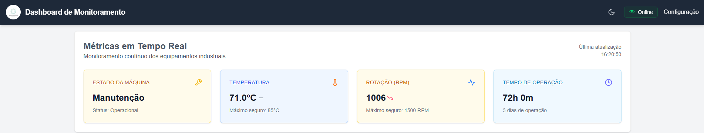
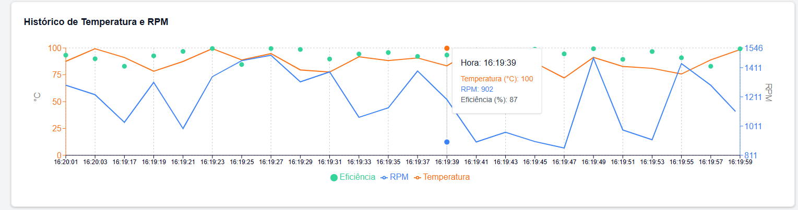
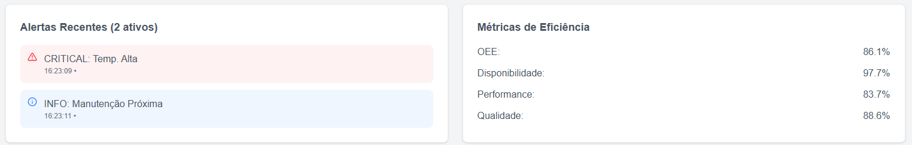

# Dashboard de Monitoramento Industrial

## 📋 Visão Geral

Este é um projeto de dashboard de monitoramento em tempo real, desenvolvido como parte de um desafio técnico. O dashboard fornece alguns dados sobre o estado da máquina, como: métricas de performance e alertas operacionais.

## 🏗️ Estrutura do Projeto

O projeto está organizado como um monorepo utilizando workspaces do npm, contendo:

- **`/packages/backend`**: API REST desenvolvida com NestJS e TypeORM
- **`/packages/frontend`**: Aplicação web desenvolvida com Next.js e React

## 🚀 Pré-requisitos

- Node.js (versão 18 ou superior)
- npm (versão 9 ou superior)
- SQLite3 (para banco de dados local)

## ⚙️ Instalação

1. **Clone o repositório**
   ```bash
   git clone https://github.com/luizAlimena96/monorepo.git
   ```

2. **Instale as dependências do projeto**
   ```bash
   # Instala as dependências do workspace raiz
   npm install
   ```

## 🖥️ Como Executar

### Ambiente de Desenvolvimento

 **Iniciar o projeto**

Na raiz do projeto, você pode usar os seguintes scripts:

- `npm run dev`: Inicia tanto o backend quanto o frontend em modo de desenvolvimento
- `npm run build`: Compila tanto o backend quanto o frontend para produção
- `npm start`: Inicia a aplicação em modo de produção (após o build)

### Iniciar ambientes separados

1. **Iniciar o Backend**
   ```bash
   # Navegue até a pasta do backend
   cd packages/backend
   
   # Inicie o servidor em modo de desenvolvimento
   npm run start:dev
   ```
   O servidor estará disponível em: `http://localhost:4000`

2. **Iniciar o Frontend**
   ```bash
   # Em um novo terminal, navegue até a pasta do frontend
   cd packages/frontend
   
   # Inicie a aplicação Next.js
   npm run dev
   ```
   O frontend estará disponível em: `http://localhost:3000`

## 📊 Funcionalidades



Nessa primeira parte foi implementado os cards de estado da máquina, que mostram a temperatura, RPM e eficiência. Assim como o heade, que contém o nome "Dashboard de Monitoramento", botão de tema claro/escuro e um indicador de online/offline, que pode-se visualizar o seu funcionamento no vídeo.



Na segunda parte foi implementado o gráfico de performance, que mostra a eficiência da máquina em tempo real, onde consegue-se ver as curvas de temperatura, RPM e para mostrar a eficiência utilizou-se pontos, que estão vinculados ao eixo y da esquerda.



Na última parte foi implementado os alertas, que mostra os alertas da máquina em tempo real, sendo que por prioridade os alertas são organizados em CRITICAL, WARNING e INFO, sendo que o alerta CRITICAL é o mais grave e o INFO é o menos grave, tendo efeitos sonoros para os alertas CRITICAL e WARNING. Na parte de Métricas de eficiência utilizou-se o mesmo princípio dos dados dos cards (vistos na primeira parte), assim são atualizados em tempo real.

Levando em conta que esse é um ambiente que os dados foram gerados através de uma seed, os dados tem um limite, e nessa caso os dados se encontram em loop.

## 🌐 Acessando o Dashboard

Após iniciar os serviços, acesse:
- **Frontend (Desenvolvimento)**: [http://localhost:3000](http://localhost:3000)
- **Backend (API)**: [http://localhost:4000](http://localhost:4000)

## 🏗️ Estrutura de Dados

O backend está configurado com dados mockados.
Pode se testar a API no seguinte endpoint: [http://localhost:4000/api/status](http://localhost:4000/api/status)

## 📊 Funcionalidades

- Visualização em tempo real do status das máquinas
- Monitoramento de temperatura e RPM
- Histórico de operação
- Alertas e notificações
- Tema claro/escuro
